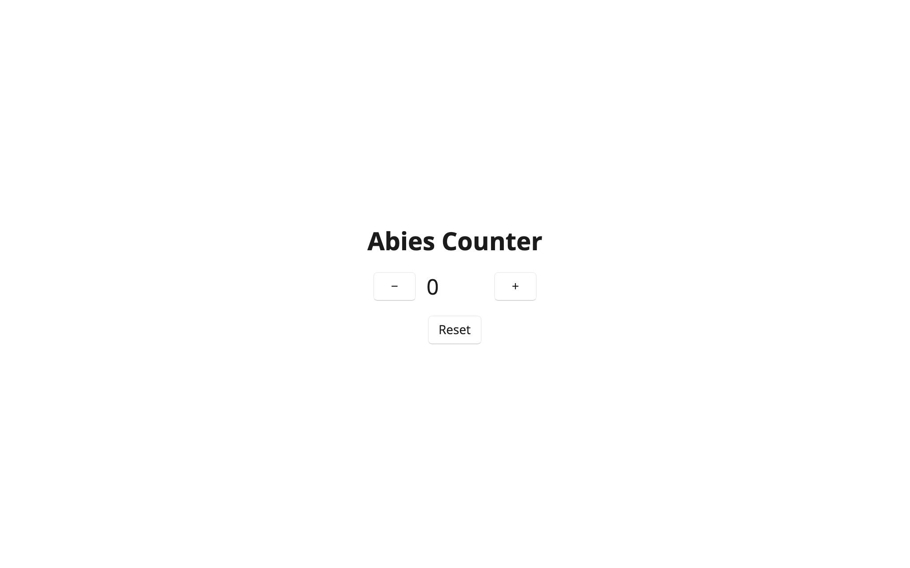

# Research: A Native WinUI Renderer for Abies

> Status: spike complete — feasibility confirmed. Companion decision record: [ADR-027](../adr/ADR-027-native-winui-renderer.md).

## Motivation

Microsoft has started [microsoft-ui-reactor](https://github.com/microsoft/microsoft-ui-reactor), an experimental
declarative C# framework over WinUI 3: a virtual element tree with reconciliation, React-style hooks
(`UseState`, `UseEffect`, `UseReducer`, …), a fluent factory DSL, a C# port of Meta's Yoga flex layout engine,
keyed LIS diffing, and element pooling. It validates the thesis Abies is built on — describe native UI
declaratively in pure C#, diff, and patch real controls — while making a different architectural bet: hooks
and component-local state instead of a single model with pure transitions.

This research answers: **can Abies target native WinUI with its existing architecture, and would the result
be structurally better than Reactor's approach?**

## Where Abies starts ahead

| | microsoft-ui-reactor | Abies |
|---|---|---|
| Paradigm | React hooks; component-local state; hook-ordering rules enforced by 40+ analyzers | Pure Elm-style MVU: single model, typed messages, pure `Transition`, effects as data, on the Picea Decider kernel |
| Targets | WinUI 3 only | Browser WASM + interactive server today; native = a third `Apply` implementation of the same runtime |
| Testing | Headless renderer (preview) | `Picea.Abies.Testing` harness drives programs with no renderer at all; replay sessions |
| Debugging | DevTools (draft) | Time-travel debugger core is platform-agnostic and shipping |
| Determinism | Hooks + effects = hidden state scattered across components | Event-sourced; the message log fully reproduces application state |

## Where Reactor is ahead (honestly)

- **Layout breadth**: a faithful Yoga port with 590 test fixtures gives Reactor a full flexbox model;
  Abies-native defers layout to real WinUI panels (`StackPanel`, `Grid`), which is simpler but less expressive
  until the vocabulary grows.
- **Element pooling and render coalescing** tuned for scroll-heavy scenarios.
- **Virtualized list recycling** is designed in; Abies-native needs an `ItemsRepeater` escape hatch (roadmap).
- **Breadth of wrapped controls**, commanding, charting, markdown, accessibility validators — sheer surface area.

## Feasibility findings (from code exploration)

The Abies core needs **zero changes** for a native renderer spike:

- The rendering seam is a single delegate: `public delegate void Apply(IReadOnlyList<Patch> patches)`
  (`Picea.Abies/Runtime.cs:15`). The browser and server renderers are just two implementations of it.
- Patches carry **real node objects** (`Element`, `Text`, …). HTML strings appear only in the
  browser/server serialization path (`RenderBatchWriter`, `Render.Html`) and the `RawHtml` node family.
- Everything a renderer needs is public: `Runtime.Start`, `Runtime.Dispatch`, the patch structs,
  `Handler.EventName` / `Handler.Command` / `Handler.WithData`.
- `Operations.Diff` returns a caller-owned list copy, so patches can be enqueued to a UI dispatcher
  asynchronously without copying.
- First render is always a single `AddRoot(Element)`; `SetChildrenHtml`/`AppendChildrenHtml` carry real
  `Node[]` despite their names.

HTML assumptions that leak into shared types, and how they are handled:

| Leak | Handling |
|---|---|
| `Handler.Name == "data-event-{event}"` | Just a diff-key string natively; the renderer reads `Handler.EventName`. |
| `ReplaceRaw` / `Render.Html` diff fallback on Text↔Element mismatches | Avoided structurally: the native vocabulary emits only `Element` nodes; text is a property attribute, never a `Text` child. Renderer throws on Raw/Text patches as a tripwire. |
| `HtmlSpec.VoidElements` (case-insensitive) skips child diffing | Native tags must never be named `Input`, `Source`, `Track`, `Base`, or `Link`. Standard WinUI control names don't collide. |
| `Document.Head` / head patches | No-op natively; `Document.Title` maps to `Window.Title` via the existing `titleChanged` injection point. |
| JSON-shaped event deserialization (`Handler.Deserializer`) | Native handlers leave `Deserializer` null and construct event-data records directly; the renderer never calls `HandlerRegistry.CreateMessage`. |
| No dispatcher abstraction; subscriptions dispatch on threadpool threads | The WinUI `Apply` marshals to `DispatcherQueue` (`HasThreadAccess` / `TryEnqueue`). |

## Architecture

```
shared app code                Picea.Abies.Native                Picea.Abies.WinUI
────────────────               ─────────────────────             ──────────────────
Model / Transition / Decide    element vocabulary                WinUIBackend :
(pure, platform-free)          (StackPanel, TextBlock, …)          INativeBackend<FrameworkElement>
        │                      native event-data records            control factory
   View (per platform) ──────► Element(Id, Tag, Attrs, Children)    property setters
        │                              │                            event wiring
Picea.Abies Runtime ── Diff ── Patch stream ── PatchInterpreter<T> ─ DispatcherQueue marshal
                                       (platform-neutral)          Runtime.Run bootstrap
                                                                        │
                                                                   Uno Platform (macOS Skia today,
                                                                   real WinUI 3 on Windows)
```

- `Picea.Abies.Native` has zero UI dependencies — vocabulary + `PatchInterpreter<T>` over an
  `INativeBackend<T>` interface, testable headlessly with a fake backend.
- `Picea.Abies.WinUI` codes against the WinUI 3 API surface; Uno Platform is the vehicle that makes that
  surface run cross-platform (`net10.0-desktop` Skia head on macOS, `net10.0-windows10.x` later).
- A future Avalonia/AppKit backend would reuse the interpreter and vocabulary unchanged.

## Spike scope

- `Picea.Abies.Counter.Native`: `NativeCounterProgram` delegates `Initialize`/`Transition`/`Decide`/
  `IsTerminal`/`Subscriptions` to the existing `CounterProgram` and supplies only a native `View` —
  demonstrating shared Model/Update with per-platform Views.
- Stretch: a "TaskTimer" sample exercising `TextBox` two-way input, keyed list reordering (`MoveChild`/LIS),
  and an interval subscription (threadpool → dispatcher marshaling).

## Results (2026-07-28)

The spike was completed in one pass with **zero changes to `Picea.Abies`**:



- **`Picea.Abies.Native`** (plain net10.0): 10-control vocabulary, native event handlers, and the
  `PatchInterpreter<T>`/`INativeBackend<T>` seam. Builds and tests anywhere.
- **`Picea.Abies.Native.Tests`**: 15 TUnit tests, all green — including a full headless MVU loop:
  native-vocabulary `View` → `Runtime.Start` → real `Operations.Diff` → interpreter → fake backend, then a
  simulated native click → handler resolution → `runtime.Dispatch` → re-rendered fake tree. Keyed reorder
  produces `MoveChild` operations against existing controls (none recreated); handler updates swap closures
  without re-attaching native events.
- **`Picea.Abies.WinUI`** (Uno.Sdk, `net10.0-desktop`): `WinUIBackend` + `Runtime.Run` bootstrap compile
  against the WinUI 3 API surface with no Uno-specific APIs.
- **`Picea.Abies.Counter.Native`**: delegates Initialize/Transition/Decide/IsTerminal/Subscriptions to the
  shared `CounterProgram` and adds only a native `View`. Runs on macOS (screenshot above; window title set
  from `Document.Title` via the existing `titleChanged` seam). An `ABIES_SNAPSHOT=<path.png>` env var renders
  the tree to PNG via `RenderTargetBitmap` + SkiaSharp and exits — a permission-free visual check usable in CI.
- Praefixum id interception works unchanged in both the plain test assembly and the Uno.Sdk app project.

Total new surface: 2 library projects, 1 test project, 1 sample app; the only repo-level change is the
`Uno.Sdk` pin in `global.json`.

## Changes made when landing

The spike was landed with three fixes, all covered by new tests:

- **Event-subscription leak.** Only `RemoveHandler`/`RemoveAttribute` reached `DetachEvent`. Subtree
  removal, replacement and root swaps dropped interpreter bookkeeping while leaving the backend
  subscribed — and `WinUIBackend` keys its detacher table by control instance, so every removed control
  and its closures stayed reachable for the process lifetime. All teardown now routes through
  `DropControl`/`DetachHandlersFor`.
- **`INativeBackend.InsertBefore` removed.** It was never called: insertions append and the diff restores
  ordering with a following `MoveChild`. A test now pins that end-to-end rather than leaving unused
  surface on a public interface.
- **Brush properties reset correctly.** `Foreground`/`Background` fell back to the current brush on a null
  value, so removing the attribute silently kept the old colour; they now clear to the theme default.

## Known limitations & roadmap

**Spike-accepted limitations**

- Vocabulary is 10 controls with a pragmatic property set; unknown tags/properties throw by design.
- `TextBox` caret can jump if a patch rewrites `Text` mid-typing (identical-text writes are skipped; a
  controlled-input strategy is future work).
- Praefixum ids are per call site: elements created in loops must set `Properties.Id`/`Properties.Key`
  (same rule as the HTML DSL).
- ~~DSL friction: `Properties` method names shadow the identically-named enums under `using static`~~ —
  fixed: the enums are now `StackOrientation` and `TextWeight`, so no aliases are needed.
  (`Alignment` never collided; the factories are `HorizontalAlignment`/`VerticalAlignment`.)
- Fire-and-forget dispatch from native events (matches browser behavior); dispatch failures are dropped.

**Roadmap**

1. **Phase 2 — vocabulary & ergonomics**: broaden controls (ItemsView, NavigationView, ContentDialog),
   element-content `Button`/`ContentControl` children, styling/theming story (map to XAML theme resources
   rather than reinventing), Roslyn analyzer (per ADR-021) for the
   reserved-void-tag and Element-only-trees rules, split the `Program` contract into Core + View interfaces
   to remove native-program delegation boilerplate.
2. **Phase 3 — scale & platform**: virtualized lists via an `ItemsRepeater` escape hatch (Reactor's
   recycling is the benchmark), accessibility/automation-peer pass, `net10.0-windows10.0.26100` head
   validated on Windows (real WinUI 3), TaskTimer-style sample exercising subscriptions + keyed lists in
   the real app.
3. **Phase 4 — packaging**: `Picea.Abies.Native` / `Picea.Abies.WinUI` NuGet packages, template
   (`abies-native`), CI integration (Uno.Sdk restore verified; solution filter as fallback).

## Verdict

**Yes — an Abies-native WinUI target is not only feasible, it is cheap.** The `Apply` seam did exactly what
it promised: native WinUI became a third renderer in ~1.3k lines without touching the core, while keeping
everything Reactor lacks — a single state tree, deterministic replay, the time-travel debugger, headless
program tests, and one program running on web, server, and native.
